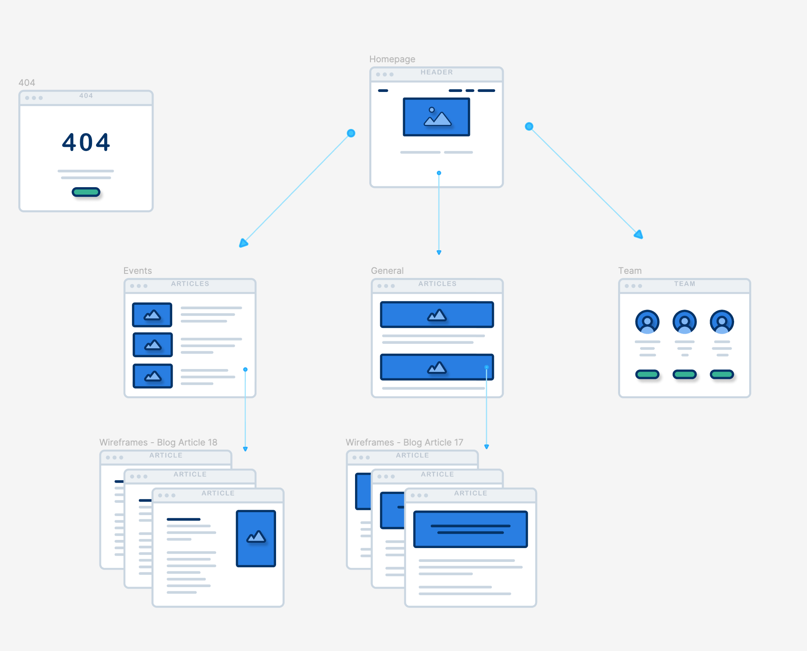

## High Level Project Definition

We are structuring the data in our project similar to how a blog would. Each page that the admin wants to save is stored as a 'post' object with some useful tags for the front end to use to display content correctly - 'id' and 'type' in specific. The ui uses get requests from the backend to populate the majority of the content for the fansite and api requests to the giphycat api to get gifs to make pages more visually interesting.

### Back-end
Data strategies: 1, 2, & 4

#### Data strategy 1:
* Static: embed content/data directly into a component.

Content for these pages has yet to be defined, and will be made when we get the structure of the site set up.

- Homepage
- General (choose between general posts)
- Events (choose between stories)
- About the creators (each of us will make our own little section)

#### Data Strategy 2:
* Public APIs: pull from a public api in some fasion

We are going to try to use the giphycat api to pull gifs onto our website. How exactly this would happen is yet to be determined, and will be a later step in the project.


#### Data strategy 4:
* A database-backed Java, Spring Boot/MVC API

#### SQL structure:
```
Types: [
	General, 
	Events, 
	Facts,...
	]
```

```
Posts: {
	Post_Id: 1,
	Type_Id: 2 -> Story or blog post or whatever,
	Title: Choppers mentors,
Date: ’yyyy-MM-dd’, 
	Images: [
	TBD
],
Writing/body: “Lorem ipsum dolor sit amet, consectetur adipiscing elit. Pellentesque ante nisi, euismod eget mattis ac, scelerisque at nunc. {{image}} Vestibulum bibendum, odio vel pretium tincidunt, sem nulla ultrices ipsum, ut lobortis metus nulla vitae ligula. Donec eu eros pharetra, elementum lorem sit amet, consequat massa. /n 
Lorem ipsum dolor sit amet, consectetur adipiscing elit. Pellentesque ante nisi, euismod eget mattis ac, scelerisque at nunc. {{image}} Vestibulum bibendum, odio vel pretium tincidunt, sem nulla ultrices ipsum, ut lobortis metus nulla vitae ligula. Donec eu eros pharetra, elementum lorem sit amet, consequat massa.”,
Spoils: [123, 246, 369]

}
```

Endpoints:

```
/api/posts -> findAll
/api/posts/events -> findByType [{post},{post},{post}]
/api/posts/general -> 
/api/posts/1 -> findById(1)

/api/events

/api/facts
```


### Front-end

Tailwind css
- mamba ui or daisy ui
React

```
- Homepage
- Facts
- Events
  - Event 1
  - Event 2
  - Etc…
- General (all blog posts?)
  - Blog 1
  - Blog 2
  - Blog 3
- About the creators
```




### Goals

- Coordinate tasks across a team.
- Practice using Git with a team.
- More and different React practice.
- Effective navigation in a React application.
- Focus on visual content: images, CSS, video.
- Use varied data strategies.

### Data Strategies

Use at least three of the four data strategies below. The static strategy and at least one database entity are required.

1. Static: embed content/data directly into a component. Static content is sometimes used in "contact us" views, "about us" views, legal privacy notices, etc.

2. Public APIs: Github has a large list of [public APIs](https://github.com/public-apis/public-apis), but don't feel limited to the list. There are many more. For any API you choose, you'll need to learn how to use it. Some APIs require an access key, some don't. Some support CORS, some don't. Some require registration, some don't. Your team will need to research, prototype, and determine if it's something you can work with. 

3. Lightweight, auto-generated APIs: one example is [json-server](https://github.com/typicode/json-server).

4. A database-backed Java, Spring Boot/MVC API


What does a post consist of: Title, typeOfPost, listOfSpoiledChapters, an image, 


Inspiration: https://violetbeauregardefansite.weebly.com/violets-biography.html 
https://thejeopardyfan.com/category/recaps 
